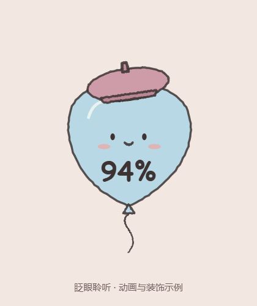
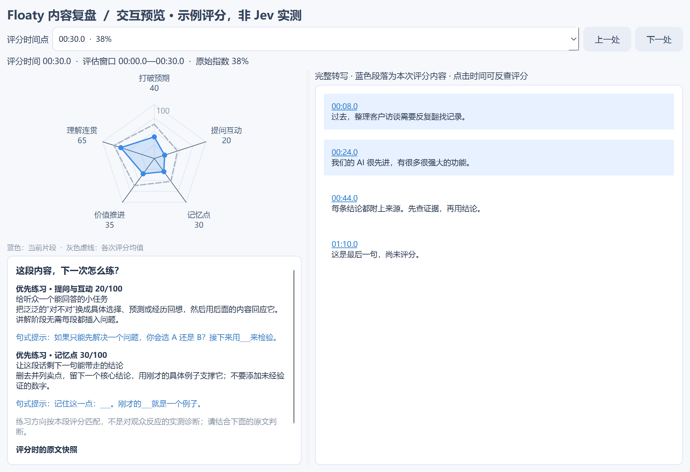
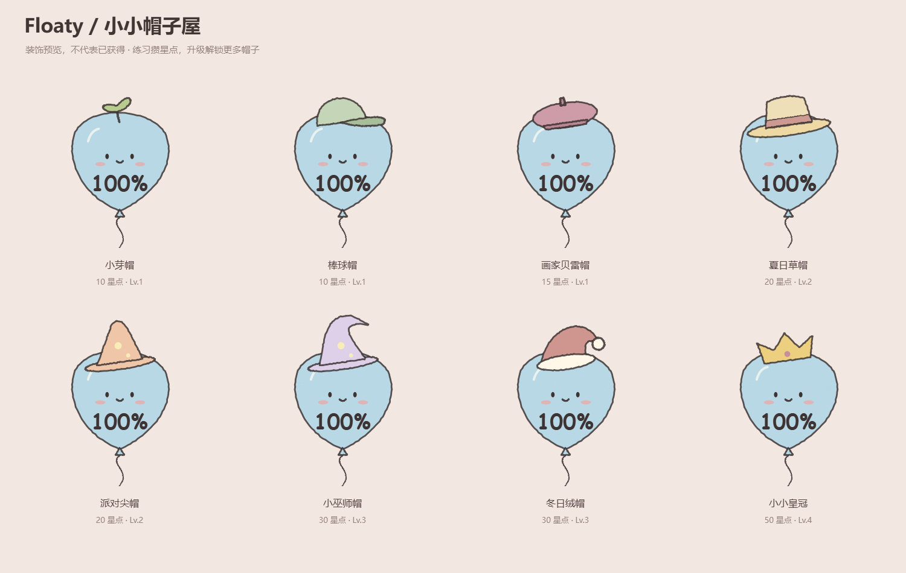

# Floaty

一个陪你练习演讲的手绘桌面气球。Windows 原生透明悬浮窗口，持续眨眼聆听，通过 **TypeSafe Jev** 对演讲内容评分。



## 功能

- **实时气球反馈**：蓝色 100% 开场，大小与颜色随指数变化；开场值不是测量结果。评分过期、等待或错误时不显示伪造分数。
- **透明大字字幕**：实时草稿与确认文字，白字描边，可开关、拖动、调整字号。
- **Jev 五维判断**：打破预期、提问互动、记忆点、听众价值与推进、理解连贯性。
- **联动复盘**：评分时间点、五维雷达图和完整转写双向对应，保留评分时的文字快照；提供维度练习建议和 Jev 原句定位。
- **成长与帽子屋**：有效练习积累星点、升级、兑换 8 款帽子。与分数高低无关，不涉及付费。
- **本机密钥管理**：密码掩码、真实接口验证状态、Windows 用户绑定加密存储。

## 在 Windows 上运行

1. 安装 [Python 3.12](https://www.python.org/downloads/windows/)，保留 Python Launcher。
2. 下载本仓库 ZIP 并解压，或克隆仓库。
3. 双击 `Setup.cmd` 创建独立环境并安装依赖。
4. 双击 `Floaty.cmd` 启动。
5. 双击气球打开设置，填写 **TypeSafe Jev API 密钥**和**豆包流式语音识别 2.0 API 密钥**，点击“应用并验证密钥”。
6. 验证通过后开始排练。右键气球可结束、复盘、开关字幕或进入帽子屋。

需要可用网络、麦克风和相应服务权限/额度。首次运行不自动录音；点击开始才采集麦克风。也支持 `TYPESAFE_API_KEY` / `JEV_API_KEY` 环境变量。

## Jev 如何参与评分

固定使用 `https://api.typesafe.ai/v1/systemone`，请求 `jev-latest`，记录实际返回的模型版本。没有其他模型或关键词规则替代正式评分。

同一次请求并行输出：

- 5 个 **Score**：0–4 档概率分布，按期望分计算 0–100 指数；权重为 25%、20%、25%、20%、10%。
- **Choice** 判断当前阶段，并选择逐事件原文依据和各维度可改进的原句。
- 4 个 **Noul** 判断有效提问、预期反转、记忆点和回应前文的出现概率。

约每 8 秒、仅在有新内容时请求。最近 30 秒用于评分，最近 3 分钟与最多 16 条事件记忆用于上下文。提示词不要求每一段都必须有提问或反转。字幕草稿不进入评分。

接口依据：[Score](https://docs.typesafe.ai/primitives/score)、[Noul](https://docs.typesafe.ai/primitives/noul)、[API](https://docs.typesafe.ai/api)。

## 复盘与装饰



雷达蓝线为选中片段、灰线为各次评分的算术均值。未评分的句子不使用邻近分数替代。时间戳表示确认转写到达应用时的演讲经过时间，并非音频逐词对齐。练习建议来自显式维度模板；Jev 仅选择原文目标，不生成改写。



有效练习需至少 60 秒、80 字确认转写，发言跨越至少 20 秒。每次 +10 星点，每 3 次升一级，升级额外 +5 星点。已拥有的帽子免费更换。正常结束或退出时结算，强制结束进程可能丢失未结算进度。

## 数据与隐私

音频发送至豆包转写，转写文字发送至 TypeSafe 评分。应用不保存音频。密钥保存在 `%LOCALAPPDATA%\Floaty\settings.dpapi`，成长数据保存在同目录 `growth.json`。本仓库不包含任何用户密钥、账号配置、录音、真实练习转写或个人参考照片。

会话转写与评分默认仅保留于内存；需要时从复盘导出 JSON。密码验证成功只表示当次服务请求通过，不保证后续网络或余额状态。

## 测试与当前限制

```powershell
.venv\Scripts\python.exe -m unittest test_floaty test_review test_growth -v
```

38 项自动检查覆盖概率校验、时间关联、字幕、密钥状态、加密存储、成长兑换等。界面预览和测试 fixture 已标为示例，不能作为真实模型表现证据。

当前为 Windows 桌面 MVP：**内容吸引力指数不等于真实注意力或观众留存率**，权重与阈值尚未经过观众实验校准；YouTube 重复播放热点也不等于留存曲线。长期课堂压力测试和有效密钥下的现场质量评测仍待完成。

这是桌面应用源码仓库，不是 GitHub Pages 网页。尚未提供独立安装包。
